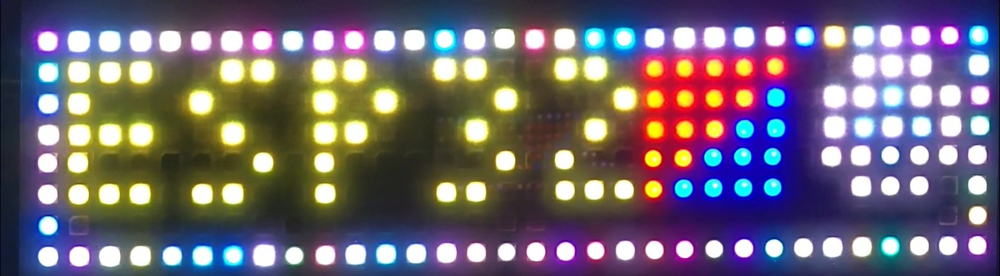

# GFX library

A high-level platform-independent graphical C++ library for microcontrollers. To make it portable, no display driver is implemented in the GFX class itself and a display driver class must be provided separately as the base class.

The example project is for ESP32 (ESP-IDF environment) and [My LED Strip Display (WS2812B) Driver](https://github.com/RBahrami/ESP32_ESP-IDF/tree/main/LED_Strip_Display). You can use this display driver as a template to create custom drivers for your displays and hardware.

>Draw and Text modules are based on [AdafruitGFX](https://github.com/adafruit/Adafruit-GFX-Library).
