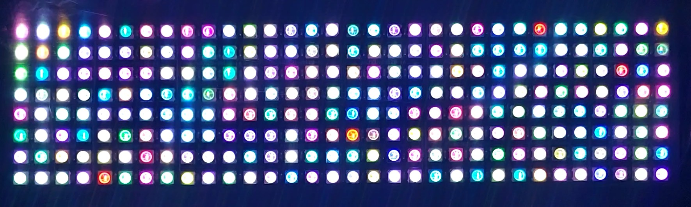

# A C++ LED Strip (WS2812B/SK6812/APA106) Display Driver for ESP32 (ESP-IDF)

This driver only provides the basic functions to work with LED Strip display. For more advanced drawing (and writing) functions, use my [GFX library](https://github.com/RBahrami/ESP32_ESP-IDF/tree/main/GFX) in combination with this display driver.

>This library uses [this component](https://github.com/UncleRus/esp-idf-lib/tree/master/components/led_strip) as the low-level driver for LED Strip itself.
